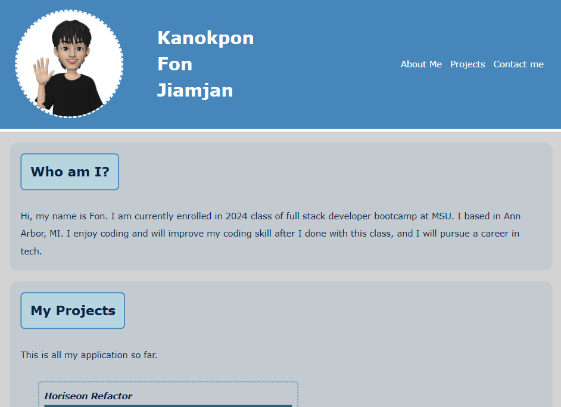

# My Profesional Porfolio Advance CSS

## Decription

This project is for me to deployed portfolio for my work samples. This work will help me understand how CSS style work with html. I learn a lot about CSS selectors, specity of the selectors, psuedo elements, and others. I work with box-style and how to tweak and decoration border. I leardn how to rearrange the webpage, and how to set the root color to reduce same coding style.

## Usage

This is my first as web-developer portfolio. When you get in the webpage you will see my name and my avatar. If you hover on the avatar photo you will see my avatar moving. On that navigation bar you can click them and it will direct you to the section that you want to see. I divided it into 3 sections: about me, projects, and contact. In the projects section, if you click the picture of the work it will link you to the deployed webpage. And in the contact me section you can click the link to email me or my Github page or back to the top of portfolio page. 

If you have smaller screen it will rearrange section to make it look better.

This is the screenshot of my portfolio deployed page.

And here is the link to my portfolio webpage.

[Fon Jiamjan Portfolio Webpage](https://fonknp.github.io/Fon-02-Professional-Portfolio-Advs-CSS/)

## Credits

Instuctor, MSU coding bootcamp week 1 and 2, and myself.

## License

MIT License